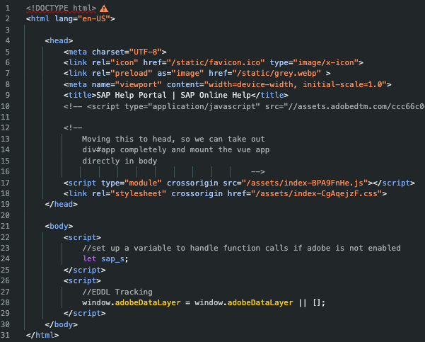
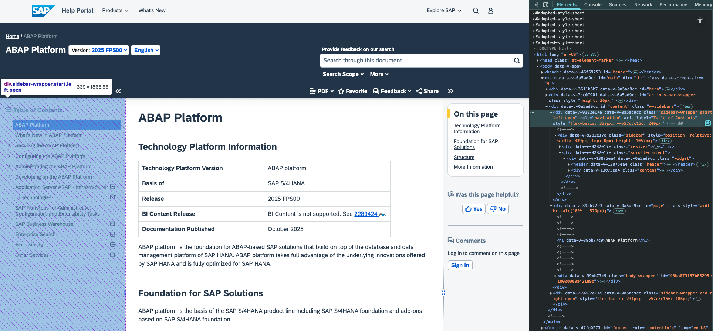
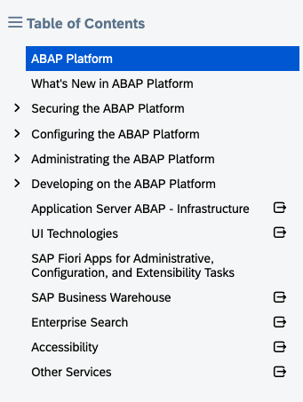
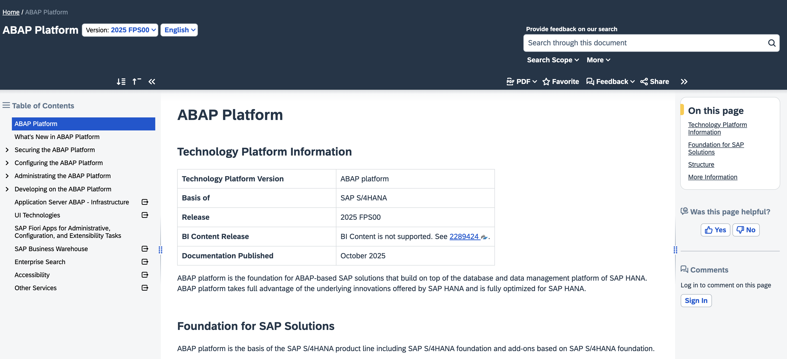
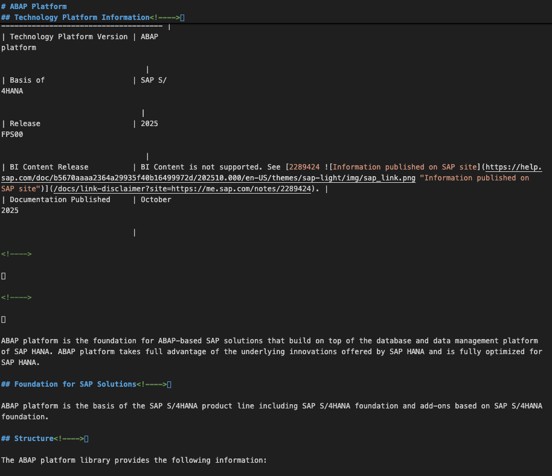
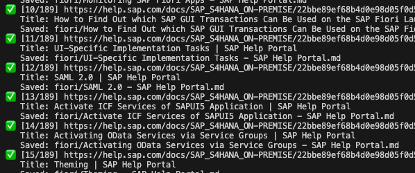
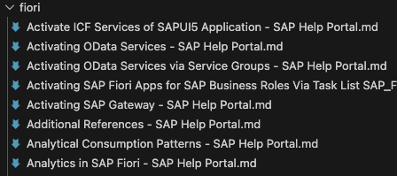
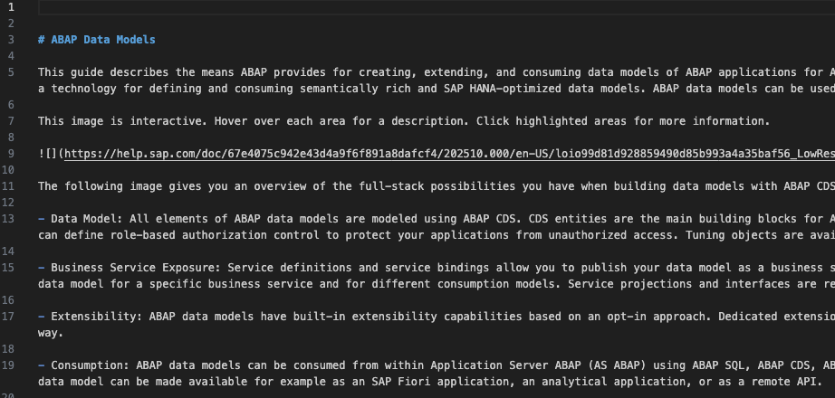

# Save websites as markdown

Retrieve links from a website. Crawl the links and store them as markdown. The markdown is cleaned and all sites are stored in one markdown file. This file can be used by an AI - local or cloud - as input for RAG.

The app and the examples are adjusted to work with the SAP Help site.

## Steps

The steps to retrieve the content as markdown are:

1. Start with a starting point url.
2. Retrieve the links included in this url. These are the links to the individual web pages with content.
3. Retrieve the content of each retrieved url.
4. Save the page content as markdown.
5. Clean up the markdown.
6. Combine all markdown files in one file.
7. Upload the file to your AI tool of choice for RAG.

## Summary

Install the dependencies. The script is using playwright and chrome. Get the links from the navigation pane from the web page. Retrieve the content of each link and save it as markdown. Clean up the markdown and save it in one file: content.md.

```sh
npm i
npx playwright install chromium
node crawl.js "https://help.sap.com/docs/ABAP_PLATFORM_NEW/b5670aaaa2364a29935f40b16499972d/48ba073157b85295e10000000a42189b.html" "/ABAP_PLATFORM_NEW" "links.txt"
node save-page-md.js links.txt pages
perl -0777 -pe 's/<!--.*?-->//gs; s/\n{3,}/\n\n/g' ./pages/*.md > content.md
```

## Step 1: Start URL

Pick any URL. I am using as an example [ABAPConf 2025 website](https://www.abapconf.org/abapconf2025) and a [SAP Help topic page for ABAP](https://help.sap.com/docs/ABAP_PLATFORM_NEW/b5670aaaa2364a29935f40b16499972d/48ba073157b85295e10000000a42189b.html).

## Step 2: Retrieve links

### Static sites

Retrieving links is the first step. The script get-links.sh extracts links from a static web page. To see the available options, run the script either without any parameter or with -h.

```sh
chmod +x get-links.sh
./get-links.sh -h
```

The script uses wget to retrieve the web site content. The script therefore only works with pages that do not use JavaScript to generate the content. For instance, the ABAPConf 2025 website is a static website.

```sh
chmod +x get-links.sh
./get-links.sh https://www.abapconf.org/abapconf2025
```

#### Examples

<details>
<summary>Examples on how to retrieve links from an example website
</summary>

##### Same-domain links only

```sh
./get-links.sh -S -u -a href,src https://www.abapconf.org/abapconf2025
```

##### Only PDF

```sh
./get-links.sh -a href -u -r '\.pdf($|\?)' https://www.abapconf.org/abapconf2025
```

##### Exclude images

```sh
./get-links.sh -a href,src -u -x '\.(png|jpg|jpeg|gif|svg)($|\?)' https://www.abapconf.org/abapconf2025
```

##### “Discover” links via spider mode (1 hop)

```sh
./get-links.sh --spider -l 1 -u https://www.abapconf.org/abapconf2025
```

</details>

### Problem: JavaScript based websites

For websites that depend on JavaScript to generate content the script won't work. For instance, the SAP Help site renders no content when JavaScript is not enabled / available.

```sh
./get-links.sh https://help.sap.com/docs/ABAP_PLATFORM_NEW/b5670aaaa2364a29935f40b16499972d/48ba073157b85295e10000000a42189b.html
```


The test script [saphelp.http](./saphelp.http) shows the output of the base page. There is not content. The whole page depends on JavaScript to work.

#### Example

<details>
<summary>Sample output of base SAP Help page index html</summary>

```html
<!DOCTYPE html>
<html lang="en-US">
	<head>
		<link rel="icon" href="/static/favicon.ico" type="image/x-icon">
		<link rel="preload" as="image" href="/static/grey.webp" >
		<title>SAP Help Portal | SAP Online Help</title>
		<script type="module" crossorigin src="/assets/index-CFgwP8hj.js"></script>
		<link rel="stylesheet" crossorigin href="/assets/index-CgHL7ofS.css">
	</head>
	<body>
		<script>
			window.adobeDataLayer = window.adobeDataLayer || [];	
		</script>
	</body>
</html>
```

Image version of the HTML:



</details>

### Retrieve links from website that demands JavaScript

A solution is to use a client that knows Javascript. Chrome is available as a headless browser, and Playwright is a tool that can be used to access websites with it. This setup allows to access websites that only work with JavaScript like SAP Help to be accessed. While possible to use Playwright to crawl an entire site, this is not what you want to do. For SAP Help, all you need it to get the links in the navigation pane. That's everything under a div with role navigation.



All the links are already loaded and part of the div. You, as a user, needs to expand the navigation node. For the browser, the content is already part of the HTML.



To retrieve all links for a given topic in SAP Help, the script must only be called once!

#### Retrieve links with Playwright

The script crawl.sh uses Playwright to access the page. Input is one URL and the which links to consider. THe prefix parameter ensures that only links that are part of a certain path are retrieved. The script only considers links that are part of a certain div:

```html
div[role="navigation"] a[href]
```

The ensure that the JavaScript has enough time to load the page timeouts are configured. In case the content takes longer as these timeouts, they can be adjusted.

```sh
node crawl.js "https://help.sap.com/docs/ABAP_PLATFORM_NEW/b5670aaaa2364a29935f40b16499972d/48ba073157b85295e10000000a42189b.html" "/ABAP_PLATFORM_NEW" "links.txt"
```

Sample links are in folder [links](./links/).

### Examples

<details>

<summary>Sample scripts for retrieving content for RAP, ADT, FLP, CDS, Fiori, UI5 and ABAP Platform</summary>

#### RAP Docu

```sh
node crawl.js "https://help.sap.com/docs/ABAP_PLATFORM_NEW/fc4c71aa50014fd1b43721701471913d/289477a81eec4d4e84c0302fb6835035.html?locale=en-US" "/docs/ABAP_PLATFORM_NEW/fc4c71aa50014fd1b43721701471913d" "links.txt"
```

#### ADT Docu

```sh
node crawl.js "https://help.sap.com/docs/ABAP_PLATFORM_NEW/c238d694b825421f940829321ffa326a/4b190c90ceba4d02a99e0a2286b89358.html?locale=en-US" "/docs/ABAP_PLATFORM_NEW/c238d694b825421f940829321ffa326a" "links_adt.txt"
```

#### Fiori Launchpad

```sh
node crawl.js "https://help.sap.com/docs/ABAP_PLATFORM_NEW/a7b390faab1140c087b8926571e942b7/f951b50a07ce41deb08ced62711fe8b5.html?locale=en-US" "/docs/ABAP_PLATFORM_NEW/a7b390faab1140c087b8926571e942b7" "links_flp.txt"
```

#### CDS

```sh
node crawl.js "https://help.sap.com/docs/abap-cloud/abap-data-models/abap-data-models?locale=en-US" "/docs/abap-cloud/abap-data-models" "links_abapcloud.txt"
```

#### SAP Fiori Overview

```sh
node crawl.js "https://help.sap.com/docs/SAP_S4HANA_ON-PREMISE/22bbe89ef68b4d0e98d05f0d56a7f6c8/4c1048feb4ea4f7d81ccbc47233a0d68.html?locale=en-US" "/docs/SAP_S4HANA_ON-PREMISE/22bbe89ef68b4d0e98d05f0d56a7f6c8" "links_fiori_overview.txt"
```

#### SAP UI5

```sh
node crawl.js "https://help.sap.com/docs/ABAP_PLATFORM_NEW/468a97775123488ab3345a0c48cadd8f/95d113be50ae40d5b0b562b84d715227.html?locale=en-US" "/docs/ABAP_PLATFORM_NEW/468a97775123488ab3345a0c48cadd8f" "links_sapui5.txt"
```

#### ABAP Platform

```sh
node crawl.js "https://help.sap.com/docs/ABAP_PLATFORM_NEW/b5670aaaa2364a29935f40b16499972d/adc7d5717257421989b37d4d78f315ec.html?locale=en-US" "/docs/ABAP_PLATFORM_NEW/b5670aaaa2364a29935f40b16499972d/" "links_abap_platform.txt"
```
</details>

## Step 3 & 4: Retrieve the content of each retrieved url and save as markdown

The above script return a list of links. These are the links to the individual web pages with the content to be retrieved.

### Static websites

For static websites, this is as easy as running wget and let pandoc convert the html to markdown. For JavaScript websites this does not work. 

```sh
wget -qO- "https://www.abapconf.org/abapconf2025" | pandoc -f html -t markdown -o page.md
```

### JavaScript website

Playwright is used to access the page, retrieve the content and save it as markdown. Some extensions are needed.

```sh
npm i playwright unified rehype-parse rehype-remark remark-stringify remark-gfm
npx playwright install chromium
```

The script [save-page-md-js](./save-page-md.js) takes as input either a file with the links, or a single link. The second parameters is the folder to store the markdown into.

```sh
node save-page-md.js "https://help.sap.com/docs/ABAP_PLATFORM_NEW/b5670aaaa2364a29935f40b16499972d/48ba073157b85295e10000000a42189b.html?locale=en-US" "page"
```

Output


Website:



Website as markdown



#### Examples

<details>
<summary>Scripts for retrieving the web page content for links stored in files.</summary>

Running the below scrips will take as input a file with a list of links and output each page as a separate md file.

**output script**



**md files in directory**



##### ABAP Platform documentation

```sh
node save-page-md.js links/links_abap_platform.txt abapplatform
```

##### CDS documentation

```sh
node save-page-md.js links/links_abapcloud.txt cds
```

##### ADT documentation

```sh
node save-page-md.js links/links_adt.txt adt
```

##### Fiori documentation

```sh
node save-page-md.js links/links_fiori_overview.txt fiori
```

##### Fiori Launchpad documentation

```sh
node save-page-md.js links/links_flp.txt flp
```

##### RAP documentation

```sh
node save-page-md.js links/links_rap.txt rap
```

##### SAPUI5 documentation

```sh
node save-page-md.js links/links_sapui5.txt rsapui5p
```

</details>

Good, but not good enough. The markdown needs to be cleaned.

## Step 5: Clean up the markdown

Perl is a good tool for this. One blocker in the markdown is \<!-- and -->. This can be removed for each downloaded md file. The result is than added to the file content.md

perl -0777 -pe 's/<!--.*?-->//gs; s/\n{3,}/\n\n/g' *.md

## Step 6: Combine all markdown files in one file.

```sh
perl -0777 -pe 's/<!--.*?-->//gs; s/\n{3,}/\n\n/g' *.md > content.md
```



## Step 7. Upload the file to your AI tool of choice for RAG.

The md file can be uploaded to your AI tool of choice. The AI should be able to read the text, understand it and later on serve as a personnal chat bot.
